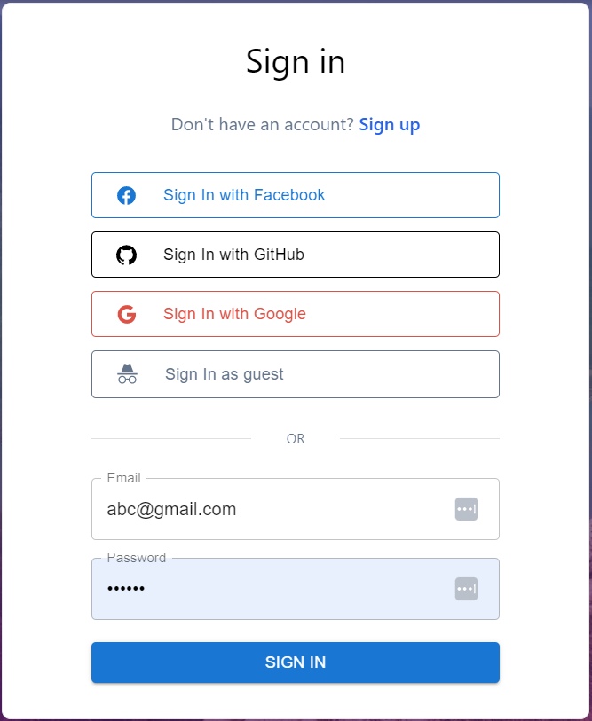
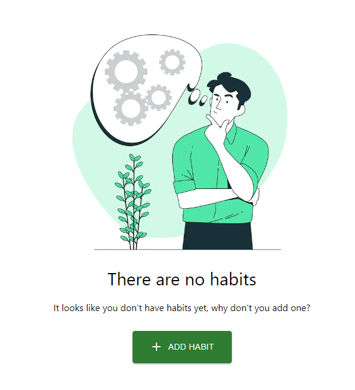
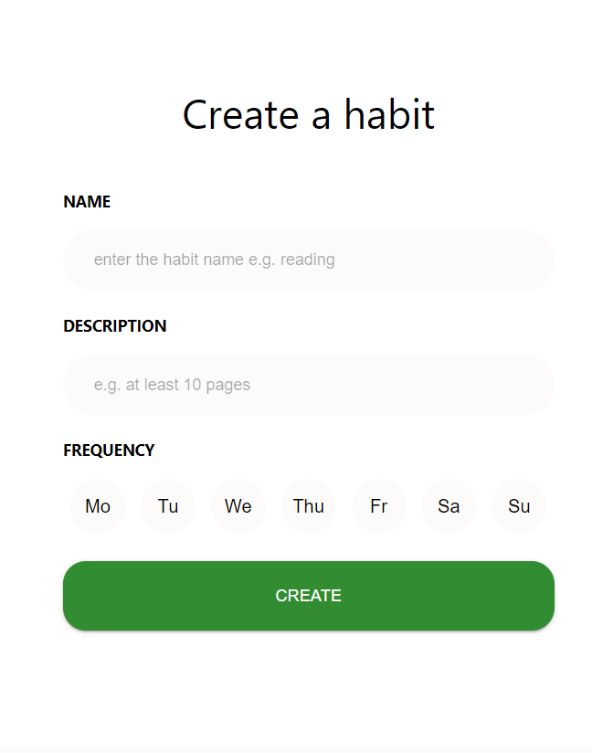
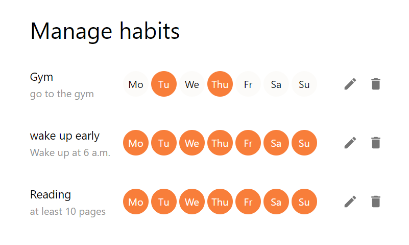
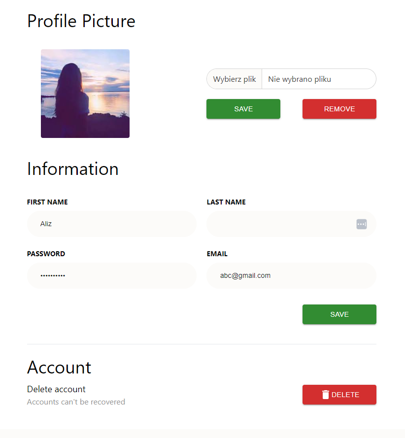

# Sprout

## About

**Sprout** app helps you keep track of your habits 💪 I took inspiration of [this](https://www.behance.net/gallery/107179009/Habit-Sleep-Tracker-UIUX-Design) beautiful UI design by Anastasia Shorohova.

### Links

[Live Site URL](https://habit-tracker-tawny.vercel.app)

## My process

### Features

- create an account with email and password
- Facebook, GitHub, Google authentication
- guest account prefilled with data to play around with application features
- add, delete, update habits
- mark habits as completed
- week and month progress visualized in calendar
- week overview pie charts in carousel
- brief statistics section with current goals, how many habits achieved today and best streak
- upload custom avatar image

### Built with

- [React](https://reactjs.org/)
- [Typescript](https://www.typescriptlang.org/docs/handbook/react.html)
- [Next.js](https://nextjs.org/)
- [Tailwind](https://tailwindcss.com/)
- [Material UI](https://mui.com/)
- [Firebase - authorization](https://firebase.google.com/)
- [Firestore](https://firebase.google.com/docs/firestore)
- Cloud Firestore
- Context Api
- [React Testing Library](https://testing-library.com/docs/react-testing-library/intro/)

## Screenshots

- Landing Page

- Sign in using **Facebook**, **GitHub**, **Google** or as **Guest**

- No Habits Page

- Add Habit

- Manage your habits - edit, delete

- Habit Dashboard

- Settings

### What I learned

So far I have learned Authentication with Firebase, the whole signing up/signing in process. Also realtime Firestore DB was a bit of a challenge to set up and structure data in logical documents/collections shallow object. It's my first time using Material-UI, so customizing them to resebmle designs was also new for me. It's still in development so more new challenges will occur for sure.

This is a [Next.js](https://nextjs.org/) project bootstrapped with [`create-next-app`](https://github.com/vercel/next.js/tree/canary/packages/create-next-app).

