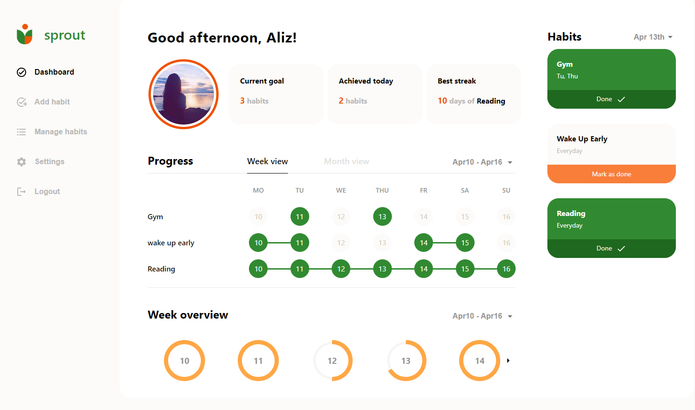

# Sprout

## About

**Sprout** app helps you keep track of your habits 💪 I took inspiration of [this](https://www.behance.net/gallery/107179009/Habit-Sleep-Tracker-UIUX-Design) beautiful UI design by Anastasia Shorohova.

### Links

[Live Site URL](https://habit-tracker-tawny.vercel.app)

## My process

### Features

- create an account with email and password
- Facebook, GitHub, Google authentication
- guest account prefilled with data to play around with application features
- add, delete, update habits
- mark habits as completed
- week and month progress visualized in calendar
- week overview pie charts in carousel
- brief statistics section with current goals, how many habits achieved today and best streak
- upload custom avatar image

### Built with

- [React](https://reactjs.org/)
- [Typescript](https://www.typescriptlang.org/docs/handbook/react.html)
- [Next.js](https://nextjs.org/)
- [Tailwind](https://tailwindcss.com/)
- [Material UI](https://mui.com/)
- [Firebase - authorization](https://firebase.google.com/)
- [Firestore](https://firebase.google.com/docs/firestore)
- Cloud Firestore
- Context Api
- [React Testing Library](https://testing-library.com/docs/react-testing-library/intro/)

## Screenshots

- Landing Page


- Sign in using **Facebook**, **GitHub**, **Google** or as **Guest**


- No Habits Page


- Add Habit


- Manage your habits - edit, delete


- Habit Dashboard



- Settings


## What I have learned

I have learned a lot of new things while building this application. It was my first bigger application, so a lot of problems and new challenges occurred. I have learned Authentication with Firebase, signing up/signing in process. Also realtime Firestore DB was a bit of a challenge to set up and structure data in logical documents/collections shallow object. I've also used Firestore Cloud to upload images.

A big challenge was to control the asynchronism of function execution and maintaining the current state of variables available for the whole application.

I also learned more about git, branching, merging and maintaining codebase. 

It was my first time using Material-UI. Now I think pure tailwind components or Flowbite library would have been a better choice, because it was a lot overriding styles with such a custom design. I've also gained confidence in building more sophisticated and complicated UI components and Responsive Layouts.

### Database structure

```json
{
    "users": {
        "user-id": {
            "habits": {
                "habit-one":{
                    "name": "Wake up at 6am",
                    "description": "Wake up 1 hour before normal wake up time for mindful activities",
                    "frequency": [0,1,2,3,4]
                }
            },
            "checkmarks": {
                "checkmark-id": {
                    "completed": false,
                    "date": "19-04-2023",
                    "habitId": "habit-one"
                }
            },
            "settings":{
                "settings-id":{
                    "email": "abc@gmail.com",
                    "firstName": "John",
                    "lastName": "Doe",
                    "password": "sdfsgagrmj1!",
                    "image": "https://firebasestorage.googleapis.com/v0/b/habit-tracker-app-pf.appspot.com/o/image%2Fimages.jfif?alt=media&token=6a109c8c-f176-40ee-97b2-328e75440d03"
                }
            }

        }
    },
}
```

## Getting started

### Clone repo and install all dependencies

```bash
git clone https://github.com/alicja1bobko/Habit-Tracker.git

cd habit-tracker
npm install
```
### Connect Firebase

Next step it to add Firebase to your project. You can follow the steps in this [link](https://firebase.google.com/docs/web/setup?hl=en), or this short instruction:

1. Login to [Firebase](https://console.firebase.google.com/).
2. Add new project.
3. Create Realtime Database in Firestore Database panel
4. In Authentication panel go to Sign-in method tab, then add Sign-in providers: Email/Password, Google, Anonymous, Facebook and Github. For the last 2 you’ll have to get Client IDs and secrets from these services.
5. In Project Overview Panel add a web app.
6. You should see a `firebaseConfig` similar to this:

    ```bash
    const firebaseConfig = {
      apiKey: "<YOUR_API_KEY>",
      authDomain: "<YOUR_AUTH_DOMAIN>",
      databaseURL: "<YOUR_DATABASE_URL>",
      projectId: "<YOUR_PROJECT_ID>",
      storageBucket: "<YOUR_STORAGE_BUCKET>",
      messagingSenderId: "<YOUR_MESSAGING_SENDER_ID>",
      appId: "<YOUR_APP_ID>",
      measurementId: "<YOUR_MEASUREMENT_ID>",
    };
    ```
8. Create `.env.local` file and use config above to fill it out.
9. Start the application with `npm run dev`. The app should be running at: http://localhost:3000


<hr>
This is a [Next.js](https://nextjs.org/) project bootstrapped with [`create-next-app`](https://github.com/vercel/next.js/tree/canary/packages/create-next-app).


